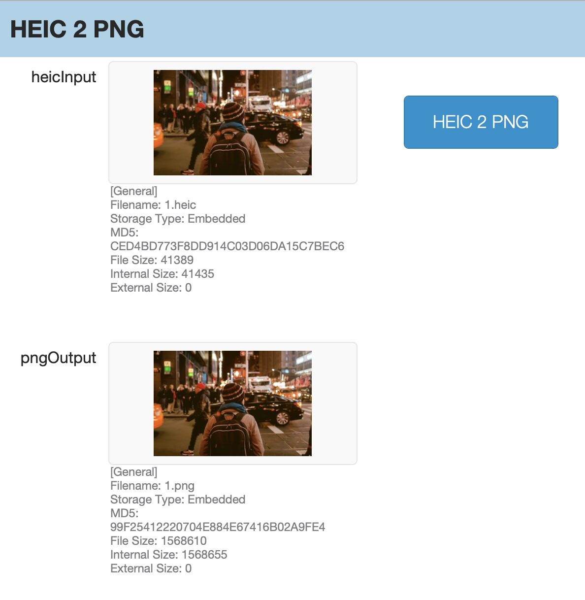
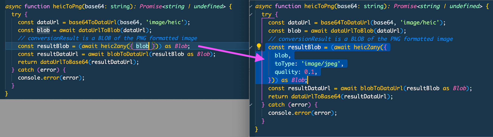

# fm-convert-heic

convert a heic to a png in a FileMaker Web Viewer

## Usage

check out the fmp12 file for example usage

## Development

### To install

```bash
npm install
```

### To Build for production (creates an html file you can put in a FileMaker field or text object)

```bash
npm run build
```

Then copy the html file in `dist`

## Example



## Notes

- This uses <https://github.com/alexcorvi/heic2any> to convert images. Please note that image metadata will not survive the conversion.

- If you want to instead convert images to jpg and reduce the quality you can make this change in `src/index.ts`, do `npm run build` to get new html for FM. Note, I chose 0.1 quality as an example but you can choose a different value.

  
